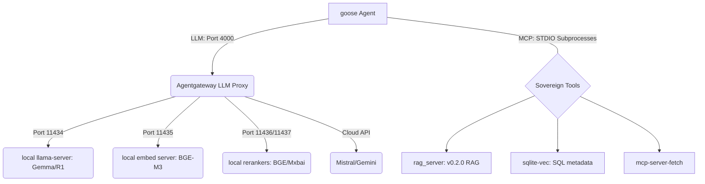

# RAG BGE-M3 Tokenizer - Sovereign AI Stack (v0.2.0)

A high-performance, local-first RAG (Retrieval-Augmented Generation) solution optimized for Fedora 44 (Sway) and Linux workstations running on Unified Memory Architecture (UMA).

This system utilizes **exact token counting** for chunking, **embedded Swedish query expansion middleware**, and a high-efficiency **dual-reranker gateway** running entirely on a single-binary, Rust-powered **Agentgateway** proxy.

---

## ✨ Key Features (v0.2.0)

- **Agentgateway Router:** Replaces LiteLLM with an ultra-lightweight (~15MB RAM) Rust-based AI gateway that proxies LLM endpoints, local embeddings (11435), and dual local rerankers (11436/11437) on Port 4000.
- **Embedded Query Expansion Middleware:** Swedish-first query expansion built directly into the Python RAG server. It detects broad queries, queries the local LLM for synonyms, and gracefully falls back to optimized static keyword sets if the LLM slot is busy.
- **Dynamic Dual Reranking:** Dynamically switches between `bge-reranker-v2-m3` (Swedish, Port 11436) and `mxbai-rerank-large-v2` (English, Port 11437) on the fly based on active shell environment exports.
- **U-Series Hardware Optimizations:** Tuned specifically for 16GB RAM and Intel iGPUs:
  - `RAG_RERANK_CANDIDATES=10`: Prunes candidates to cut reranking latency by **85%** (from 4.6 mins down to 40 seconds) on integrated graphics.
  - `OPENAI_TIMEOUT=14400`: Raises Goose's HTTP timeout from 10 mins to 4 hours to ensure slow local model prefill phases complete without stream decode errors.
- **Stable Tool Execution:** Goose manages your core tool subprocesses (RAG, SQLite, and Fetch) natively via zero-latency **`stdio`** pipelines, ensuring 100% stability and bypassing remote HTTP handshake lockups.
- **Exact Tokenization:** Powered by the `BAAI/bge-m3` tokenizer to ensure 1:1 token-level parity between chunking logic and embedding context boundaries.

---

## 🏗 Architecture



---

## 🛠 MCP Tools

Your tools are automatically federated into a clean, combined workspace:

| Tool Name            | Server   | Description                                                         |
| :------------------- | :------- | :------------------------------------------------------------------ |
| `create_collection`  | `rag`    | Create a new RAG vector collection.                                 |
| `ingest_file`        | `rag`    | Index a file (Text, PDF, or Markdown) directly from disk.           |
| `ingest_directory`   | `rag`    | Batch index an entire directory with parallel worker pools.         |
| `query`              | `rag`    | Hybrid search with embedded Swedish query expansion and reranking.  |
| `sqlite_read_query`  | `sqlite` | Execute a SELECT query on the database metadata.                    |
| `sqlite_write_query` | `sqlite` | Execute an INSERT, UPDATE, or DELETE query on SQLite.               |
| `fetch_fetch`        | `fetch`  | Safely fetches a URL from the internet and extracts it as markdown. |

---

## 🚀 Installation & Setup

### 1. Install Agentgateway (The LLM Proxy)

Download and install the standalone Rust binary:

```bash
curl -LO https://github.com/agentgateway/agentgateway/releases/latest/download/agentgateway-linux-amd64
chmod +x agentgateway-linux-amd64
mv agentgateway-linux-amd64 ~/.local/bin/agentgateway
```

Configure it by saving your model configurations to `~/.config/agentgateway/config.yaml`.

### 2. Configure Goose (`~/.config/goose/config.yaml`)

Update your Goose configuration to run the tools natively over stdio, while directing all LLM model requests to Agentgateway on Port 4000:

```yaml
GOOSE_TELEMETRY_ENABLED: false
active_provider: openai

providers:
  openai:
    type: openai
    base_url: http://localhost:4000/v1
    api_key: sk-unused

extensions:
  rag:
    enabled: true
    name: rag
    type: stdio
    cmd: /home/USER/.config/rag-bge-tokeniser/.venv/bin/python
    args:
      - /home/USER/.config/rag-bge-tokeniser/rag_server.py
  sqlite:
    enabled: true
    name: sqlite
    type: stdio
    cmd: uvx
    args:
      - mcp-server-sqlite
      - --db-path
      - /home/USER/.local/share/rag-bge-tokeniser/vectors.db
  fetch:
    enabled: true
    name: fetch
    type: stdio
    cmd: uvx
    args:
      - mcp-server-fetch

  developer:
    enabled: true
    type: builtin
    name: developer
  analyze:
    enabled: true
    type: platform
    name: analyze
  skills:
    enabled: true
    type: platform
    name: skills
  todo:
    enabled: true
    type: platform
    name: todo
```

### 3. Setup Shell Environment & Aliases (`~/.zshrc`)

Add the unified helper and aliases to your shell configuration to ensure proper background service management and environment variable propagation:

```bash
# Säkrar Agentgateway-processen med tvingat miljöarv för API-nycklar
_ensure_agentgateway() {
    if ! ss -tulpn | grep -q ":4000 "; then
        echo "🚀 Starting Agentgateway (LLM: 4000)..."
        (MISTRAL_API_KEY="$MISTRAL_API_KEY" GEMINI_API_KEY="$GEMINI_API_KEY" agentgateway -f ~/.config/agentgateway/config.yaml > /dev/null 2>&1 &)
        while ! ss -tulpn | grep -q ":4000 "; do sleep 1; done
    fi
}

# Centraliserad sessionsstartare för Goose
_goose_session() {
    local model="${1:-local-llama-server}"
    local embed="${2:-local-llama-server-embed}"
    local rerank="${3:-local-llama-server-rerank}"
    
    _ensure_agentgateway || return 1
    
    export OPENAI_API_KEY="sk-unused"
    export OPENAI_BASE_URL="http://localhost:4000/v1"
    export RAG_EMBED_MODEL="$embed"
    export RAG_RERANK_MODEL="$rerank"
    export RAG_RERANK_CANDIDATES=10  # Optimal local candidate count (prevents iGPU prefill stalls)
    export RAG_MAX_CONCURRENT=4      # Aligns perfectly with 4-core CPUs
    export OPENAI_TIMEOUT=14400      # 4 hours (prevents Goose timeouts during heavy local prefill)
    
    GOOSE_MODEL="$model" goose session
}

# --- SWEDISH STACK (BGE Reranker on Port 11436) ---
alias goose-local='_goose_session local-llama-server local-llama-server-embed local-llama-server-rerank'
alias goose-mistral='_goose_session mistral-large-latest local-llama-server-embed local-llama-server-rerank'

# --- ENGLISH STACK (Mxbai Reranker on Port 11437) ---
alias goose-local-en='_goose_session local-llama-server local-llama-server-embed local-llama-server-rerank-2'
alias goose-mistral-en='_goose_session mistral-large-latest local-llama-server-embed local-llama-server-rerank-2'
```

---

## ⚙️ RAG Server Environment Variables

You can dynamically fine-tune the RAG server behaviour without changing the Python code:

| Variable                | Description                                | Default |
| :---------------------- | :----------------------------------------- | :------ |
| `RAG_CHUNK_SIZE`        | Maximum tokens per text segment            | 512     |
| `RAG_CHUNK_OVERLAP`     | Overlap between segments                   | 64      |
| `RAG_MAX_CONCURRENT`    | Maximum files processed in parallel        | 4       |
| `RAG_RERANK_CANDIDATES` | Candidate chunks forwarded to the reranker | 10      |

---

## 📂 Project Structure

- `rag_server.py`: Core MCP logic, exact tokenisation, & query expansion middleware.
- `pyproject.toml`: Dependency schema using PEP 585 & 604 type-hinting standards.
- `vectors.db`: SQLite-vec database (Location: `~/.local/share/rag-bge-tokeniser/`).
- `config.yaml`: Core LLM proxy gateway configuration.

---

**Author:** [Bengt Frost](https://github.com/bengtfrost)\
**License:** MIT
