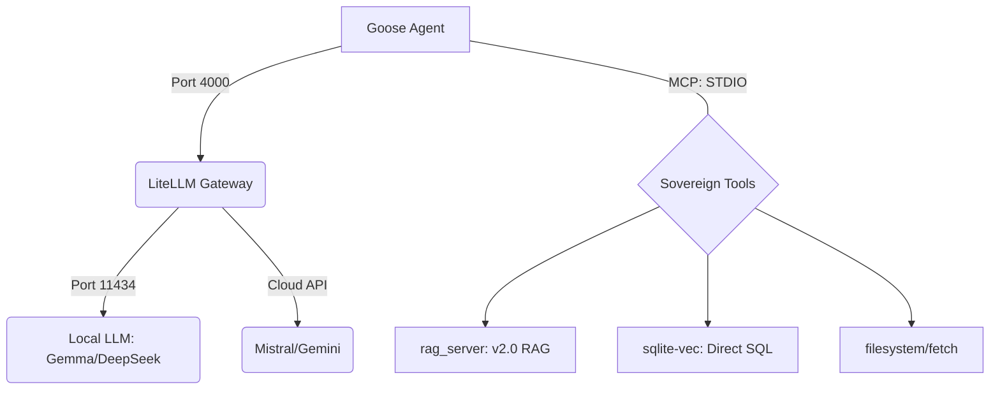

# RAG BGE-M3 Tokenizer - Sovereign AI Stack (v2.0.0)

A high-performance, local RAG (Retrieval-Augmented Generation) solution optimized for Fedora 44 (Sway) and Linux power users. This system utilizes **exact token counting** for chunking and **parallel embedding processing**, orchestrated by the Rust-powered **Goose** agent via a **LiteLLM** gateway.

## ✨ Key Features (v2.0.0)

- **Goose Orchestration:** Migration to a stable, agentic CLI that handles long-running missions without session timeouts.
- **LiteLLM Gateway:** A central proxy to unify Local LLMs (llama-server) and Cloud APIs (Mistral/Gemini) into a single OpenAI-compatible stream.
- **Multi-format Support:** Ingest PDF, Markdown (.md), RST, and plain text.
- **Exact Tokenization:** Powered by the `BAAI/bge-m3` tokenizer to ensure 1:1 parity between chunking logic and embedding model constraints.
- **Parallel Indexing:** Uses `asyncio.Semaphore` to process multiple files concurrently.
- **Sovereign Metadata:** Direct SQL access to the vector database for structural analysis.

## 🏗 Architecture



## 🛠 MCP Tools

| Tool                 | Description                                                       |
| :------------------- | :---------------------------------------------------------------- |
| `create_collection`  | Create a new RAG collection.                                      |
| `ingest_file`        | Index a file (Text, PDF, or Markdown) directly from disk.         |
| `ingest_directory`   | Batch index an entire directory with progress bars and ETA.       |
| `query`              | Hybrid search using Vector ANN followed by a BGE-Reranking stage. |
| `sqlite__read_query` | Perform raw SQL queries on the metadata and vector stats.         |
| `delete_documents`   | Selective deletion or full collection purge.                      |

## 🚀 Installation & Setup

### 1. Install Goose (The Orchestrator)

Install the binary directly (Rust-based performance):

```bash
curl -fsSL https://github.com/aaif-goose/goose/releases/download/stable/download_cli.sh | CONFIGURE=false bash
```

### 2. Configure the Stack

Update your `~/.config/goose/config.yaml` to include your Sovereign tools and point the provider to your LiteLLM gateway:

```yaml
active_provider: openai
providers:
  openai:
    type: openai
    base_url: http://localhost:4000/v1
    api_key: sk-unused

extensions:
  rag:
    enabled: true
    name: rag
    type: stdio
    cmd: /home/USER/.config/rag-bge-tokeniser/.venv/bin/python
    args: [/home/USER/.config/rag-bge-tokeniser/rag_server.py]
  sqlite:
    enabled: true
    name: sqlite
    type: stdio
    cmd: uvx
    args: [
      mcp-server-sqlite,
      --db-path,
      /home/USER/.local/share/rag-bge-tokeniser/vectors.db,
    ]
```

### 3. Setup Aliases (~/.zshrc)

```bash
# Gateway ensured start
alias goose-local='export OPENAI_API_KEY="sk-unused" && export OPENAI_BASE_URL="http://localhost:4000/v1" && GOOSE_MODEL=local goose session'

# Start the full Sovereign RAG stack
rag-start-full() {
    pkill -f "port 11434" ; pkill -f "port 4000"
    # Start your local llama-servers, LiteLLM proxy, and then Goose
    # ...
    goose-local
}
```

## ⚙️ Environment Variables (Optional)

| Variable             | Description                   | Default |
| :------------------- | :---------------------------- | :------ |
| `RAG_CHUNK_SIZE`     | Maximum tokens per segment    | 512     |
| `RAG_MAX_CONCURRENT` | Max files indexed in parallel | 3       |

## 📂 Project Structure

- `rag_server.py`: Core MCP logic & Exact Tokenizer.
- `server_config.json`: Legacy/External MCP config.
- `vectors.db`: SQLite-vec database.

---

**Author:** [Bengt Frost](https://github.com/bengtfrost)\
**License:** MIT
